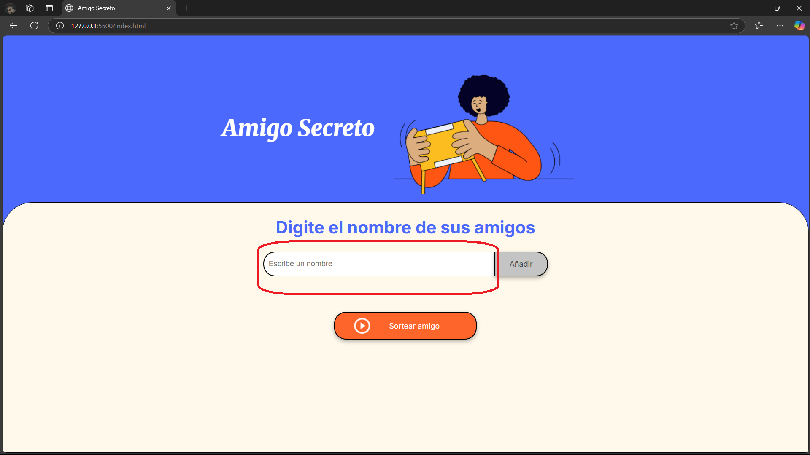
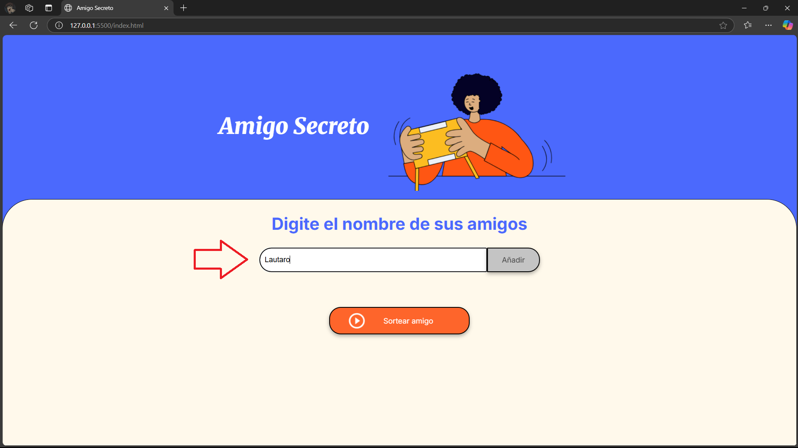
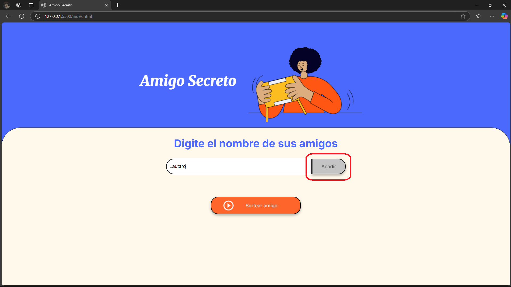
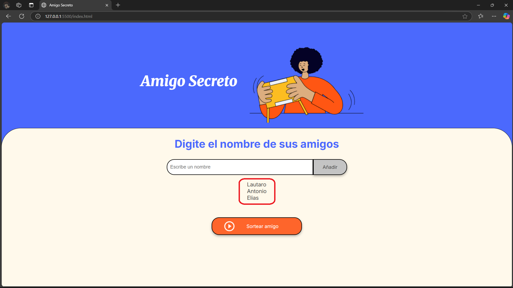
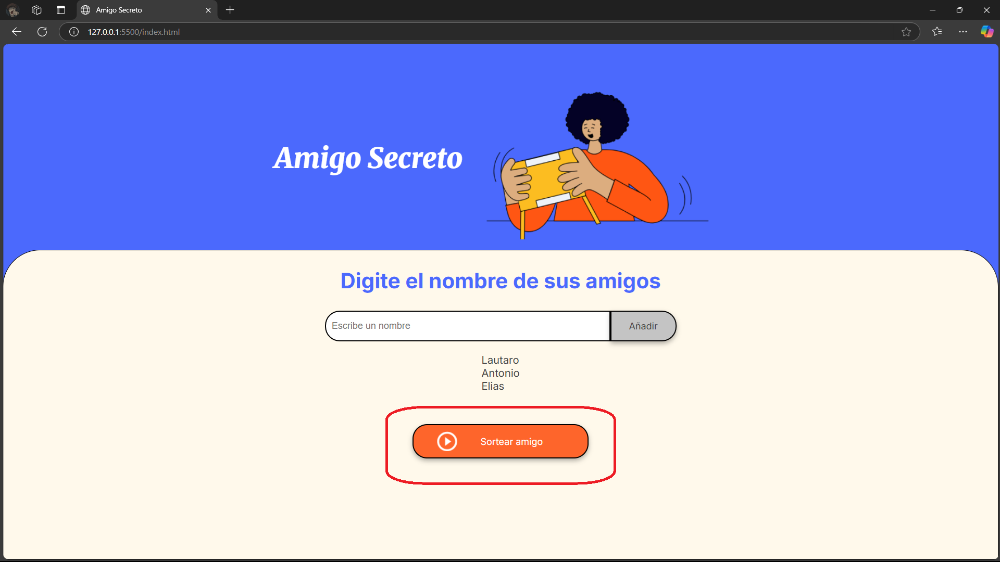
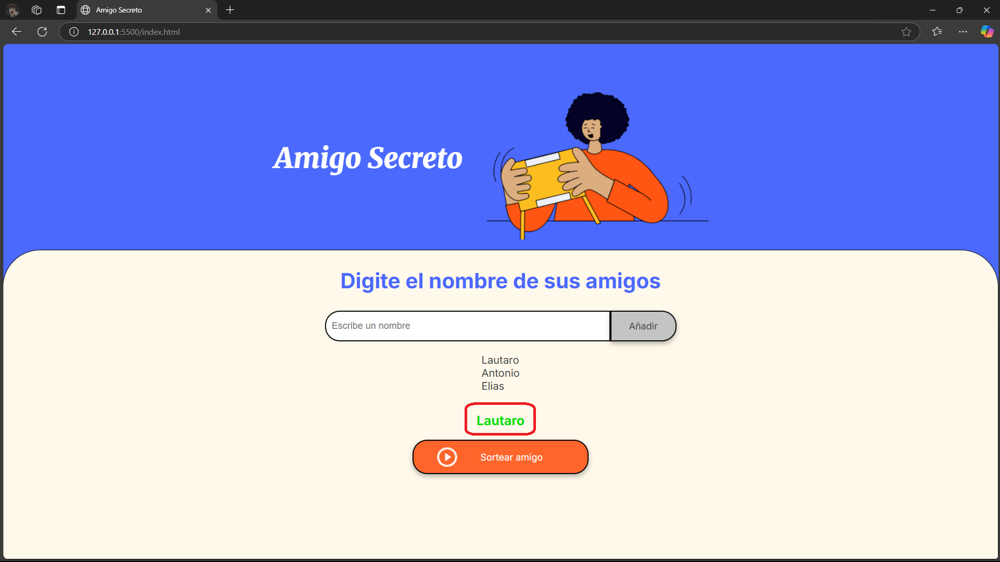
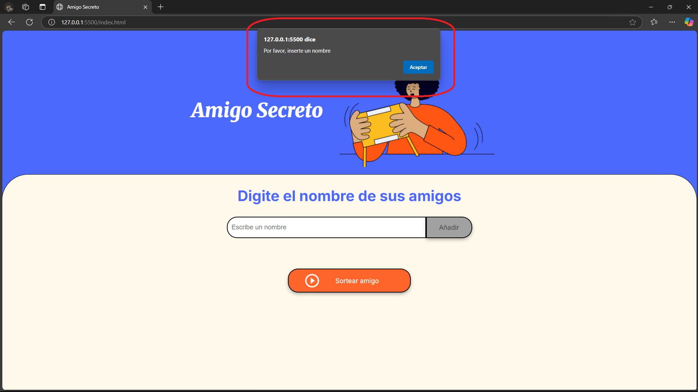
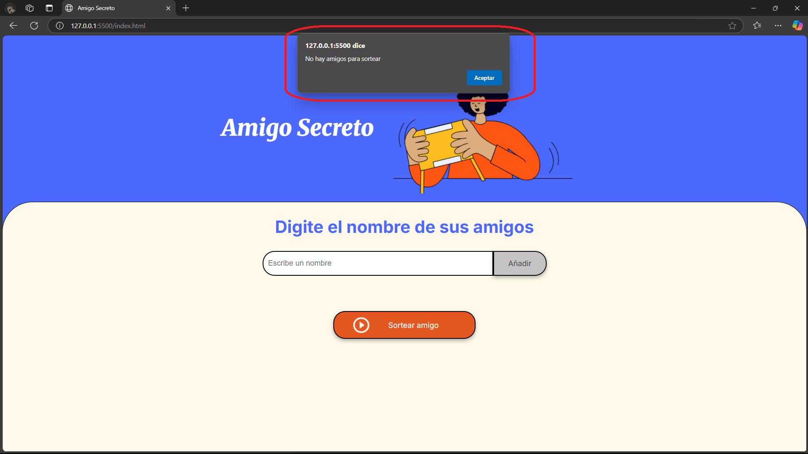

# <ins>Challenge Amigo Secreto</ins>
En esta presentación se enseñará las funciones y utilidades de la página web. Las más importantes son:
* Agregar nombres de amigos a una lista y poder ser actualizada. 
* Saber identificar si el campo de texto está vacío.
* Generar un número al azar y elegir un nombre de la lista a través de ese número.

## Lista de Amigos

> A través del imput se ingresa los nombres deseados para poner en la lista, para ingresarlos se clickea el botón añadir:

   

> A continuación los nombres son ordenados en una lista para ser sorteados:

 

> El codigo crea un número al azar coincidente a una de las posiciones de los números, el número es generado a partir de la cantidad de nombres que fueron escritos:

---

 Como adicional se crean alertas al momento de tener el imput vacío, tanto a la hora de añadir un nombre como cuando el usuario quiere sortear:

 

Gracias por su atención ¡Espero que haya sido de su agrado y nos volvamos a encontrar en la siguiente etapa del curso!

Autor: Lautaro Alejandro Becerra.